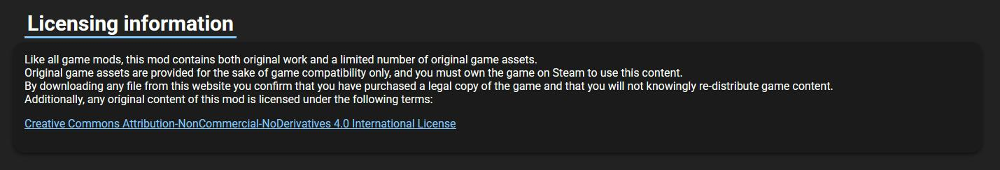
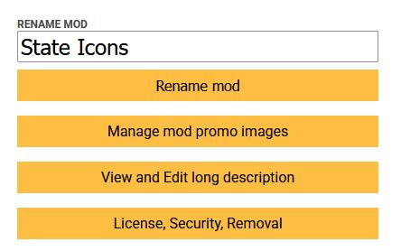
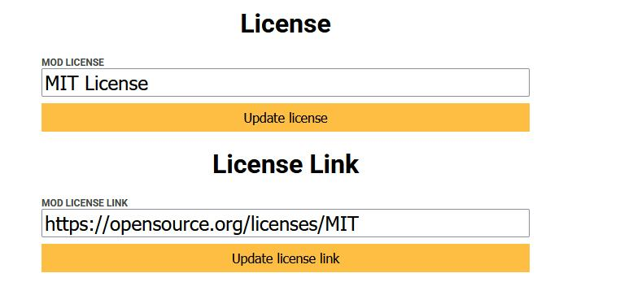

# Basic Licensing Guide (for Omori Mods and Similar Stuff)

# Introduction

Licensing is a simple and streamlined way to express what other users
can and cannot do with your work that you publish onto mods.one. By
default, when you upload a mod to the site, it will be under the *[Creative Commons Attribution-NonCommercial-NoDerivatives 4.0 International License](https://creativecommons.org/licenses/by-nc-nd/4.0/).* This is an example of what you will see on the bottom of every mod page:

In basic terms, that means you are free to use the mod's original assets
in any medium or format if you give proper credit, do not use it for
commercial purposes, and do not distribute any modified material. Note
that these terms are *not exhaustive* and certain exemptions may apply,
especially under more explicit permission given by the mod author.

This may sound like nothing more than just legal boredom, but it is very
important that you follow the terms of the license provided as Omori
mods are open source by nature. That means anyone can technically openly
access the files and assets. Having this mutual respect goes a long way
in communities like this one. Gross violation may result in your mod
page being taken down and your project being subsequently parodied by
someone else (not that that's ever happened :3)

In normal cases though, if you get expressed permission from the
creator, and you agree to credit them most will be cool with you doing
what you want.

Conversely, not taking the time to set up a proper license may lead to
conflict or confusion down the line. So, it's worth taking a bit of time
to set up if this sounds like something worth looking into!

# Adding a License

Open your mod page editor and click on "License, Security, Removal:"

Here, you can put the name of the license and a link to the terms.

Alternatively, if your work contains various licenses, indicate so in
the name field and detail what falls under what license in the
description.

# Sample Licenses

Here are a few open licenses that you can use that have been used for
Omori mods!

**Creative Commons** -- This family of licenses is great if you wish to
distribute your content openly but under certain conditions or expressly
dedicating it under public domain. These conditions may include:

- Attribution: Decide if credit must be given to you, the creator.

- Commerciality: Decide if assets can be used for commercial purposes,
  such as a monetized YouTube channel or for original games sold for a
  price.

- Derivatives: Decide if users can remix or build upon your material.

- ShareAlike: Decide if users must release the content under the same
  license.

You can generate a CC license here:
<https://chooser-beta.creativecommons.org/>

**MIT License** -- A license that grants the user permission to use the
files and assets without restriction, so long as they provide the
appropriate copyright notice in their software. OneLoader and certain
plug-ins have used this license. If you want people to freely use your
project while covering your ass, this is good to use

<https://opensource.org/license/mit>

These also follow a similar format, but with different lawyers:

**GNU Public License** -
<https://www.gnu.org/licenses/gpl-3.0.html#license-text>

**FreeBSD License -**
<https://www.freebsd.org/copyright/freebsd-license/>

Other open licenses:

**WTFPL: Do What the Fuck You Want to Public License --** Vessel uses
this license: <http://www.wtfpl.net/about/>

**Open Data Commons Public Domain Dedication and License -**
<https://opendatacommons.org/licenses/pddl/1-0/>

**The Un-License -** <https://unlicense.org/>
